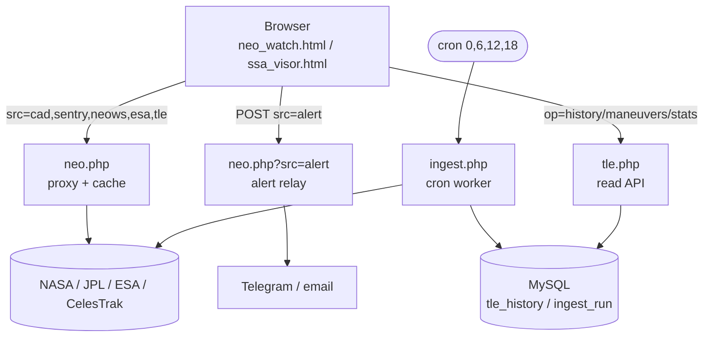
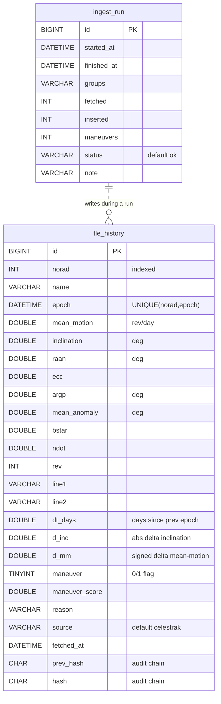

<a id="top"></a>
# newspace.live — Full Manual / Manual Completo

Space Situational Awareness & Planetary Defense suite.
Suite de Conciencia Situacional Espacial y Defensa Planetaria.

> **Bilingual document.** Each section is **English first**, then **Español**.
> **Documento bilingüe.** Cada sección va **primero en inglés**, luego **Español**.
>
> *Note on visuals:* the "screenshots" in §3 are **labeled interface layout diagrams** (wireframes), not photographic captures — they document the real on-screen arrangement of each module. The database diagram in §2 reflects the actual `schema.sql`.
> *Nota sobre las imágenes:* las "capturas" del §3 son **diagramas de diseño de interfaz** (wireframes) etiquetados, no fotos — documentan la disposición real en pantalla de cada módulo. El diagrama de base del §2 refleja el `schema.sql` real.

---

<a id="toc"></a>
## Table of Contents / Índice

1. [System overview / Visión general](#s1)
2. [Database / Base de datos](#s2)
3. [Interface layouts — "screenshots" / Diseño de interfaz — "capturas"](#s3)
4. [User Manual / Manual de Usuario](#s4)
   - 4.1 [Common controls / Controles comunes](#s4-1)
   - 4.2 [NEO Watch](#s4-2)
   - 4.3 [SSA Visor / Visor SSA](#s4-3)
5. [Administrator Manual / Manual de Administrador](#s5)
   - 5.1 [Requirements / Requisitos](#s5-1)
   - 5.2 [File inventory / Inventario de archivos](#s5-2)
   - 5.3 [Initial installation / Instalación inicial](#s5-3)
   - 5.4 [Configuration reference / Referencia de configuración](#s5-4)
   - 5.5 [Maintenance / Mantenimiento](#s5-5)
   - 5.6 [Security / Seguridad](#s5-6)
   - 5.7 [Troubleshooting / Resolución de problemas](#s5-7)
6. [Honest limitations / Límites honestos](#s6)

---

<a id="s1"></a>
## 1. System overview / Visión general
[↑ TOC](#toc)

### 🇬🇧 English

newspace.live hosts **two independent browser tools** plus a **small PHP/MySQL back-end** on a cPanel host.

| Module | File | Purpose |
|---|---|---|
| **NEO Watch** | `neo_watch.html` | Near-Earth-object / planetary-defense watch: close approaches, impact-risk lists, alerts, observation tasking. |
| **SSA Visor** | `ssa_visor.html` | Satellite situational picture: live SGP4 tracking, conjunctions, territory overflights, passes, case management. |

**Design rule:** the back-end does **not** propagate orbits — the browser does that with SGP4. The back-end exists only to (a) hold secrets, (b) persist TLE history, (c) relay outbound alerts.



Plain-text fallback:

```
Browser ──► neo_watch.html / ssa_visor.html
              ├─► neo.php?src=...        proxy + cache  ──► NASA/JPL/ESA/CelesTrak
              ├─► neo.php?src=alert POST alert relay    ──► Telegram / email
              └─► tle.php?op=...         read API        ──► MySQL
cron ──► ingest.php ──► CelesTrak ──► MySQL (tle_history)
```

### 🇪🇸 Español

newspace.live aloja **dos herramientas de navegador independientes** más un **back-end chico PHP/MySQL** en un hosting cPanel.

| Módulo | Archivo | Para qué sirve |
|---|---|---|
| **NEO Watch** | `neo_watch.html` | Vigilancia de objetos cercanos / defensa planetaria: aproximaciones, listas de riesgo, alertas, tasking de observación. |
| **Visor SSA** | `ssa_visor.html` | Imagen situacional de satélites: seguimiento SGP4 en vivo, conjunciones, sobrevuelos, pasos, gestión de casos. |

**Regla de diseño:** el back-end **no** propaga órbitas — eso lo hace el navegador con SGP4. El back-end existe solo para (a) guardar secretos, (b) persistir la historia de TLE, (c) relayar alertas de salida. (Ver el mismo diagrama de arriba.)

---

<a id="s2"></a>
## 2. Database / Base de datos
[↑ TOC](#toc)

### 🇬🇧 English

Two InnoDB tables. `tle_history` stores **one row per object per new TLE epoch**, with deltas vs. the previous epoch, a heuristic maneuver flag, and a tamper-evident hash chain (`prev_hash → hash`). `ingest_run` logs each cron run. There is no hard foreign key — `ingest_run` is a run log; rows are associated logically by time/source.



Indexes on `tle_history`: `UNIQUE(norad, epoch)`, `KEY(norad)`, `KEY(fetched_at)`, `KEY(maneuver, fetched_at)`.

### 🇪🇸 Español

Dos tablas InnoDB. `tle_history` guarda **una fila por objeto por época de TLE nueva**, con los deltas contra la época anterior, una marca heurística de maniobra, y una cadena de hash a prueba de manipulación (`prev_hash → hash`). `ingest_run` registra cada corrida del cron. No hay clave foránea dura — `ingest_run` es un log; las filas se asocian lógicamente por tiempo/origen. (Mismo diagrama ER de arriba.)

Índices en `tle_history`: `UNIQUE(norad, epoch)`, `KEY(norad)`, `KEY(fetched_at)`, `KEY(maneuver, fetched_at)`.

---

<a id="s3"></a>
## 3. Interface layouts — "screenshots" / Diseño de interfaz — "capturas"
[↑ TOC](#toc)

> These wireframes show the real layout of each screen. Buttons are referenced by icon + label throughout the manual.
> Estos wireframes muestran el diseño real de cada pantalla. En el manual los botones se citan por ícono + etiqueta.

### 3.1 NEO Watch

```
┌────────────────────────────────────────────────────────────────────────┐
│ NEO WATCH   [UTC clock]   Pause  Now │ History │ Sort▼ ⬍ │ Source▼ │ 🔍  │
│                                       Report   🔔3   ⚙   SSA↗   🇬🇧 EN  │
├──────────────────────────────────────────────────────────────────────── ┤
│  ▸OBSERVE   ORIENT   DECIDE   ACT          ← OODA stages                  │
├───────────────────────────────┬──────────────────────────────────────── ┤
│   ╭──── radar / scope ────╮    │  Close approaches  (sorted · filtered)   │
│   │      ·   ·     ·      │    │  ──────────────────────────────────────  │
│   │    ·    (Earth)    ·  │    │  2025-… │ 0.8 LD │ 35 m │ H22 │ CAD ✓ESA │
│   │       ·      ·       │    │  2025-… │ 3.1 LD │ …                       │
│   ╰───────────────────────╯    │  …  (click a row → drill-down detail)    │
│   timeline  ▁▂▅█▂▁              │                                          │
└────────────────────────────────────────────────────────────────────────┘
   ✓ = corroborated by both Sentry and ESA NEOCC
```

### 3.2 SSA Visor / Visor SSA

```
┌────────────────────────────────────────────────────────────────────────┐
│ SSA·UY  [clock]  Country▼  Station▼  [City…🔍]  Catalogue▼ Speed▼ Auto▼  │
│         Pause Now ↻ Plan  Exports▼  Live  🔔  📋  NEO↗  🇬🇧 EN           │
├──────────────────────────────────────────────────────┬───────────────── ┤
│  ▸OBSERVE   ORIENT   DECIDE   ACT     ← OODA bar       │ ▣ Catalogue  148 │
├──────────────────────────────────────────────────────┤ ▣ Above horiz. 9 │
│                                                        │ ▣ Nat. assets  2 │
│       ·  ·   world map + satellites   ·  ·             │ 🔔 Alerts      1 │
│       ·    ▢ territory of interest      ·              │ ── Registry ──   │
│       ·            △ station            ·              │ ── Events ──     │
│                                                        │ ⚠ conjunction    │
│  [ + ] [ − ] [ reset ] [ ⌂ station ]                   │ ⚠ overflight     │
│                          ╭─ local sky dome ─╮          │ ── Horizon now ──│
│                          │   N  ·   ·   E    │          │  OBJECT  el  az  │
└──────────────────────────┴────────────────────────────┴───────────────── ┘
```

### 3.3 Alert console / Consola de alertas (🔔)

```
┌─ Alert console / Consola de alertas ───────────────────── ✕ ┐
│ 🔴 critical   OBJECT-X    conjunction · 0.4 km                │
│      first seen 12:30Z · escalation: ANALYST                 │
│      [ Acknowledge / Acusar ]                                │
│ 🟠 warning    OBJECT-Y    territory overflight               │
│ ──────────────────────────────────────────────────────────  │
│ Webhook [ https://newspace.live/neo.php?src=alert          ] │
│ ☑ notify   ☑ sound        [ Dispatch / Despachar ]           │
└──────────────────────────────────────────────────────────────┘
  Dispatch with no active alert sends a TEST alert (verifies Telegram).
  Despachar sin alerta activa envía una alerta de PRUEBA (verifica Telegram).
```

### 3.4 Case console / Consola de casos (📋)

```
┌─ Case history / Historial de casos ──── Filter[All▼] Export Clear ✕ ┐
│ OBJECT-X                                              [ ACK ]        │
│ conjunction · 0.4 km · UY                                           │
│ opened 12:30Z · acknowledged 12:34Z · dispatched 12:35Z (telegram) │
│ ─────────────────────────────────────────────────────────────────  │
│ OBJECT-Y                                              [ RESOLVED ]   │
│ overflight · UY                                                     │
│ opened 11:02Z · resolved 11:40Z                                    │
└─────────────────────────────────────────────────────────────────────┘
```

---

<a id="s4"></a>
## 4. User Manual / Manual de Usuario
[↑ TOC](#toc)

<a id="s4-1"></a>
### 4.1 Common controls / Controles comunes

**🇬🇧** Both tools default to English and switch to Spanish with the flag button (🇺🇸 ES / 🇬🇧 EN). The clock is **UTC**; **Pause/Now** controls the simulated time used for propagation and passes. Data is pulled live through your server; if a source is briefly down, the status line says so and the tool keeps working. Jump between modules with **SSA ↗ / NEO ↗**. Both follow the **OODA** loop: Observe → Orient → Decide → Act.

> **Data honesty.** The tools never invent data. When something can't be computed precisely (approximate footprint, estimated decay window, single-source object), the interface says so. Treat estimates as screening aids.

**🇪🇸** Ambas arrancan en inglés y cambian a español con el botón de bandera (🇺🇸 ES / 🇬🇧 EN). El reloj es **UTC**; **Pausa/Ahora** controla el tiempo simulado para propagación y pasos. Los datos llegan en vivo por tu servidor; si una fuente cae un momento, la barra de estado lo indica y se sigue trabajando. Saltás entre módulos con **SSA ↗ / NEO ↗**. Ambas siguen el ciclo **OODA**: Observar → Orientar → Decidir → Actuar.

> **Honestidad del dato.** Las herramientas no inventan datos. Cuando algo no se puede calcular con precisión (footprint aproximado, ventana de reentrada estimada, objeto de una sola fuente), la interfaz lo aclara. Tratá las estimaciones como ayudas de cribado.

<a id="s4-2"></a>
### 4.2 NEO Watch

**🇬🇧**
- **Observe** — radar + timeline of close approaches. Distances in **lunar distances (LD)**; dots sized by diameter; past events fainter. **History** toggles the last 12 months. Click a dot/row for detail.
- **Orient** — switches to the **impact-risk** view (JPL Sentry + ESA NEOCC). A ✓ marks objects corroborated by **both** catalogs; Torino/Palermo shown per object.
- **Decide** — sort (date/distance/size/magnitude), flip ascending/descending with the arrow, filter by source (CAD/NeoWs/Sentry/ESA/Fireball).
- **Act** — the **alert console** (🔔) lists threshold-crossing objects by severity; **acknowledge** them, unacknowledged ones **escalate** (operator → analyst → commander), **dispatch** relays to Telegram/email. **OALM tasking** gives a priority observation list, exportable.
- **Settings (⚙)** — observation window, max LD, limiting magnitude, twilight, **worldwide city search**, and the **alert thresholds** (miss distance, imminent window, Palermo/Torino, large-object rule, escalation minutes, webhook, notifications, sound).
- **Report** — reentry/situation report.

**🇪🇸**
- **Observar** — radar + línea de tiempo de aproximaciones. Distancias en **distancias lunares (LD)**; puntos dimensionados por diámetro; eventos pasados más tenues. **Histórico** activa los últimos 12 meses. Clic en punto/fila para detalle.
- **Orientar** — cambia a la vista de **riesgo de impacto** (JPL Sentry + ESA NEOCC). Un ✓ marca objetos corroborados por **ambos** catálogos; Torino/Palermo por objeto.
- **Decidir** — ordená (fecha/distancia/tamaño/magnitud), invertí con la flecha, filtrá por fuente (CAD/NeoWs/Sentry/ESA/Fireball).
- **Actuar** — la **consola de alertas** (🔔) lista los objetos que cruzan umbrales por severidad; **acusalos**, los no acusados **escalan** (operador → analista → comandante), **despachar** relaya a Telegram/correo. El **tasking OALM** da una lista de observación priorizada, exportable.
- **Ajustes (⚙)** — ventana de observación, LD máxima, magnitud límite, crepúsculo, **buscador de ciudad mundial**, y los **umbrales de alerta** (distancia, ventana inminente, Palermo/Torino, regla de objeto grande, minutos de escalamiento, webhook, notificaciones, sonido).
- **Reporte** — reporte de reentrada/situación.

<a id="s4-3"></a>
### 4.3 SSA Visor / Visor SSA

**🇬🇧**
- **Where you are** — **Country selector** (30 options incl. 🌍 Global, all of Latin America, Europe, North America and more) sets the territory of interest (Uruguay uses its real outline; others an approximate bounding-box footprint). **Station selector** picks an observing site. **City search (🔍)** geocodes any city worldwide and places your observer there.
- **Map & sky** — world map of tracked satellites (SGP4); wheel/buttons zoom, drag to pan, click to select; the dome shows az/el for the station.
- **Side panel** — counters (catalogue / above horizon / national assets / alerts), national registry, **events feed** (conjunctions, overflights, reentry candidates, element anomalies, interest-zone crossings) and the live above-horizon table.
- **Object detail** — orbital parameters, next pass, **TLE epoch age + freshness**, **estimated decay window**, **confidence index**, and (backend on) **TLE history** curves with **flagged maneuvers**.
- **Decide & Act** — OODA bar counts objects/threats/actions/alerts. **Decide** opens a prioritized course-of-action list + tasking export. **Act** opens the alert console (same ack/escalate/dispatch). Tasking uses **real SGP4 passes** (rise, max elevation, illumination).
- **Plan** — upcoming observable passes for your station(s).
- **Cases (📋)** — each alert becomes a case with lifecycle (open → acknowledged → resolved) and timeline; filter active/resolved/all, export CSV, clear closed. Stored in your browser.
- **Exports** — doctrinal report (HTML), situation (JSON), and CCSDS-style OMM / OEM / CDM / MPC.

**🇪🇸**
- **Dónde estás** — el **selector de país** (30 opciones incl. 🌍 Global, toda Latinoamérica, Europa, Norteamérica y más) define el territorio de interés (Uruguay usa su contorno real; los demás un footprint aproximado por rectángulo). El **selector de estación** elige el sitio de observación. El **buscador de ciudad (🔍)** geocodifica cualquier ciudad del mundo y pone ahí tu observador.
- **Mapa y cielo** — mapamundi de satélites seguidos (SGP4); zoom con rueda/botones, arrastrás para desplazar, clic para seleccionar; la cúpula muestra az/el para la estación.
- **Panel lateral** — contadores (catálogo / sobre el horizonte / activos nacionales / alertas), registro nacional, **feed de eventos** (conjunciones, sobrevuelos, candidatos a reentrada, anomalías de elementos, cruces de zonas) y la tabla en vivo sobre el horizonte.
- **Detalle del objeto** — parámetros orbitales, próximo pasaje, **antigüedad de época del TLE + frescura**, **ventana de decaimiento estimada**, **índice de confianza**, y (con backend) **historia de TLE** con **maniobras marcadas**.
- **Decidir y Actuar** — la barra OODA cuenta objetos/amenazas/acciones/alertas. **Decidir** abre la lista priorizada de curso de acción + exportación de tasking. **Actuar** abre la consola de alertas (mismo acusar/escalar/despachar). El tasking usa **pasos SGP4 reales** (orto, elevación máxima, iluminación).
- **Plan** — próximos pasos observables para tu(s) estación(es).
- **Casos (📋)** — cada alerta se vuelve un caso con ciclo de vida (abierto → acusado → resuelto) y línea de tiempo; filtrá activos/resueltos/todos, exportá CSV, limpiá cerrados. Se guardan en tu navegador.
- **Exportes** — reporte doctrinal (HTML), situación (JSON), y estilo CCSDS OMM / OEM / CDM / MPC.

---

<a id="s5"></a>
## 5. Administrator Manual / Manual de Administrador
[↑ TOC](#toc)

<a id="s5-1"></a>
### 5.1 Requirements / Requisitos

**🇬🇧** cPanel hosting with **PHP 8.x** (tested on PHP 8.3 / `ea-php83`) and **MySQL**. PHP extensions: **`pdo_mysql`** (required), `curl` (recommended); `mbstring` not required. Outbound HTTPS allowed (CelesTrak, api.telegram.org). Ability to set **cron jobs**.

**🇪🇸** Hosting cPanel con **PHP 8.x** (probado en PHP 8.3 / `ea-php83`) y **MySQL**. Extensiones: **`pdo_mysql`** (obligatoria), `curl` (recomendada); `mbstring` no hace falta. HTTPS de salida habilitado (CelesTrak, api.telegram.org). Poder crear **cron jobs**.

<a id="s5-2"></a>
### 5.2 File inventory / Inventario de archivos

| File | Role / Rol | Web-served / Servido |
|---|---|---|
| `neo_watch.html` | NEO Watch front-end | yes / sí |
| `ssa_visor.html` | SSA Visor front-end | yes / sí |
| `neo.php` | Proxy + cache + **alert relay** | yes / sí |
| `tle.php` | TLE-history read API | yes / sí |
| `ingest.php` | Cron worker (CelesTrak → DB) | yes, token / sí, con token |
| `config.sample.php` | Template → copy to `config.php` | **denied / bloqueado** |
| `config.php` | **Secrets** (DB, Telegram, token) | **denied / bloqueado** |
| `db.php` | PDO connection | denied / bloqueado |
| `schema.sql` | Database schema | denied / bloqueado |
| `.htaccess` | Protects secrets & cache | — |

<a id="s5-3"></a>
### 5.3 Initial installation / Instalación inicial

**🇬🇧**

1. **Upload** all files to the domain root; ensure a writable `neo_cache/` directory exists.
2. **Permissions (critical).** cPanel/suexec refuses to serve group/world-writable files, and unzipping can leave files at `0600`. Set **files `644`**, **directories `755`** (File Manager → *Permissions* → `0644`). A wrong value is the classic cause of **403 Forbidden** on a file that exists.
3. **Database.** cPanel → *MySQL Databases*: create DB + user, add user with ALL PRIVILEGES. Then *phpMyAdmin* → select DB → *Import* → `schema.sql` (creates `tle_history`, `ingest_run`).
4. **Secrets.** Copy `config.sample.php` → `config.php` and fill it (see §5.4). Minimum: `db`, `telegram`, `ingest.token`, `allowed_origins`.
5. **Telegram.** Create a bot with **@BotFather**; **open the bot and press Start** (a bot can't message a user who hasn't started it — skipping this gives HTTP 403); get `chat_id` from `https://api.telegram.org/bot<TOKEN>/getUpdates` (`"chat":{"id":…}`; groups are negative, often `-100…`); put `token`/`chat_id` in `config.php` (no quotes inside the value).
6. **Cron (every 6 h, CLI, no token).** Use **explicit hours**, never `*/6` inside scripts:
   ```
   0 0,6,12,18 * * * /usr/local/bin/ea-php83 /home/USER/public_html/ingest.php >/dev/null 2>&1
   ```
   Adjust the PHP binary and path (cPanel shows the exact PHP path).
7. **Verify.**
   - Proxy: `https://SITE/neo.php?src=tle&GROUP=visual&FORMAT=tle` → TLE list.
   - Ingest: run `ingest.php` (CLI or `?token=…`) → `{"run":1,"fetched":148,"inserted":148,"maneuvers":0}`.
   - Read API: `tle.php?op=stats` → counts; `?op=history&norad=25544` → rows.
   - Relay:
     ```
     curl -X POST "https://SITE/neo.php?src=alert" \
       -H "Content-Type: application/json" -H "Origin: https://SITE" \
       -d '{"system":"TEST","alerts":[{"severity":"critical","object":"TEST","message":"test"}]}'
     ```
     Expect `{"ok":true,"channels":["telegram"]}` + a Telegram message.

**🇪🇸**

1. **Subí** todos los archivos a la raíz del dominio; asegurá una carpeta `neo_cache/` con escritura.
2. **Permisos (clave).** cPanel/suexec se niega a servir archivos con escritura de grupo/otros, y un unzip puede dejarlos en `0600`. Dejá **archivos `644`**, **directorios `755`** (File Manager → *Permissions* → `0644`). Un valor mal es la causa clásica de **403 Forbidden** sobre un archivo que existe.
3. **Base de datos.** cPanel → *MySQL Databases*: creá base + usuario, asigná el usuario con ALL PRIVILEGES. Luego *phpMyAdmin* → seleccioná la base → *Importar* → `schema.sql` (crea `tle_history`, `ingest_run`).
4. **Secretos.** Copiá `config.sample.php` → `config.php` y completalo (ver §5.4). Mínimo: `db`, `telegram`, `ingest.token`, `allowed_origins`.
5. **Telegram.** Creá un bot con **@BotFather**; **abrí el bot y tocá Start** (un bot no puede escribirle a quien no lo inició — saltarlo da HTTP 403); obtené el `chat_id` de `https://api.telegram.org/bot<TOKEN>/getUpdates` (`"chat":{"id":…}`; los grupos son negativos, suele ser `-100…`); poné `token`/`chat_id` en `config.php` (sin comillas dentro del valor).
6. **Cron (cada 6 h, CLI, sin token).** Usá **horas explícitas**, nunca `*/6` dentro de scripts:
   ```
   0 0,6,12,18 * * * /usr/local/bin/ea-php83 /home/USUARIO/public_html/ingest.php >/dev/null 2>&1
   ```
   Ajustá el binario PHP y la ruta (cPanel muestra la ruta exacta).
7. **Verificá.** Igual que en inglés: `neo.php?src=tle…` devuelve TLEs; `ingest.php` devuelve el JSON de corrida; `tle.php?op=stats` y `?op=history&norad=25544`; y el `curl` de alerta debe dar `{"ok":true,"channels":["telegram"]}` y un mensaje en Telegram.

<a id="s5-4"></a>
### 5.4 Configuration reference / Referencia de `config.php`

| Key / Clave | Meaning / Significado |
|---|---|
| `allowed_origins` | CORS allow-list, e.g. `['https://newspace.live']`. The relay only accepts POSTs from these. / Lista blanca CORS; el relay solo acepta POSTs desde acá. |
| `neows_key` | Optional NASA NeoWs key (a default is baked into `neo.php`). / Clave NeoWs opcional (hay una por defecto). |
| `telegram.token` / `telegram.chat_id` | Bot token + target chat (server-side only). / Token del bot + chat destino (solo servidor). |
| `email.to` / `email.from` | Optional email relay via PHP `mail()`. / Relay opcional por correo. |
| `alert.rate_per_min` | Anti-abuse cap on alert POSTs/min. / Tope anti-abuso de POSTs/min. |
| `db.host/name/user/pass` | MySQL credentials. / Credenciales MySQL. |
| `ingest.token` | Token to run `ingest.php` over HTTP (not needed via CLI). / Token para `ingest.php` por HTTP (por CLI no hace falta). |
| `ingest.groups` | CelesTrak groups, e.g. `['visual']` (`'active'` ≈ 11k objects). / Grupos CelesTrak. |
| `ingest.max_objects` | Per-run cap (0 = none). / Tope por corrida. |
| `ingest.man_dinc_deg` / `man_dmm_raise` | Maneuver-detection thresholds. / Umbrales del detector de maniobras. |

The front-end constants `SSA_BACKEND` / `TLE_API` (in the HTML) point at `neo.php` / `tle.php`. On a different domain, update them and `allowed_origins`.
Las constantes `SSA_BACKEND` / `TLE_API` (en el HTML) apuntan a `neo.php` / `tle.php`. En otro dominio, actualizalas junto con `allowed_origins`.

<a id="s5-5"></a>
### 5.5 Maintenance / Mantenimiento

**🇬🇧**
- **Ingestion** — `tle.php?op=stats` shows the last run and totals; `inserted:0` just means no new epochs (not an error). Errors appear in the run's `errors`/`note` and in `ingest_run`.
- **DB growth** — one row per object per new epoch. `visual` stays small; `active` grows fast. Prune from the **oldest** end if needed.
- **Hash chain** — each row chains `prev_hash → hash`; deleting middle rows breaks verification.
- **Cache** — `neo.php` self-cleans files older than 24 h. No action needed.
- **App updates** — ask users to hard-reload (Ctrl/Cmd+F5); browsers cache HTML aggressively.
- **Backups** — export the MySQL DB; keep a safe copy of `config.php` (secrets) out of web-accessible backups.

**🇪🇸**
- **Ingesta** — `tle.php?op=stats` muestra la última corrida y totales; `inserted:0` solo significa que no hubo épocas nuevas (no es error). Los errores van en `errors`/`note` y en `ingest_run`.
- **Crecimiento de la base** — una fila por objeto por época nueva. `visual` se mantiene chico; `active` crece rápido. Podá desde el extremo **más viejo** si hace falta.
- **Cadena de hash** — cada fila encadena `prev_hash → hash`; borrar filas del medio rompe la verificación.
- **Caché** — `neo.php` autolimpia archivos de más de 24 h. Sin acción.
- **Actualizar apps** — pediles recarga forzada (Ctrl/Cmd+F5); el navegador cachea el HTML.
- **Backups** — exportá la base MySQL; guardá una copia segura de `config.php` fuera de backups accesibles por web.

<a id="s5-6"></a>
### 5.6 Security / Seguridad

**🇬🇧** `.htaccess` denies web access to `config.php`, `config.sample.php`, `db.php`, `schema.sql` and `*.cache` — keep it (`config.php`/`db.php` are PHP and wouldn't leak source, but `schema.sql` would). The relay has **fixed server-side recipients**, an **origin check** and a **rate limit**, so it can't become an open relay. **Rotate `ingest.token`** periodically and after any exposure. If the **Telegram token** was ever public, revoke it with @BotFather (`/revoke`) and update `config.php` (the `chat_id` is not secret). Keep permissions `644`/`755`, never `666`/`777`.

**🇪🇸** `.htaccess` bloquea el acceso web a `config.php`, `config.sample.php`, `db.php`, `schema.sql` y `*.cache` — mantenelo (`config.php`/`db.php` son PHP y no filtran código, pero `schema.sql` sí). El relay tiene **destinatarios fijos del lado servidor**, **control de origen** y **rate limit**, así que no se vuelve relay abierto. **Rotá `ingest.token`** periódicamente y tras cualquier exposición. Si el **token de Telegram** fue público, revocalo con @BotFather (`/revoke`) y actualizá `config.php` (el `chat_id` no es secreto). Mantené permisos `644`/`755`, nunca `666`/`777`.

<a id="s5-7"></a>
### 5.7 Troubleshooting / Resolución de problemas

| Symptom / Síntoma | Cause / Causa | Fix / Solución |
|---|---|---|
| **403 Forbidden** on an existing file / en archivo existente | `0600`/`0666` perms (after unzip) / permisos tras unzip | `chmod 644` files, `755` dirs |
| **403** with `.htaccess` present / con `.htaccess` | directive rejected by `AllowOverride` / directiva rechazada | rename `.htaccess` to test; use the minimal one / renombrá para probar |
| **500** on `ingest.php`, blank / en blanco | PHP parse error (`*/` in comment) or missing `db.php` / parse o falta `db.php` | use shipped version; it reports cause as JSON / reporta la causa en JSON |
| **500**, JSON says `pdo_mysql` | extension off / extensión apagada | cPanel → Select PHP Version → enable `pdo_mysql` |
| `ingest.php` **token inválido** | mismatch or quotes (`%27`) in URL / comillas en URL | pass raw token, no quotes / token crudo sin comillas |
| Map loads then vanishes, panel empty / mapa carga y desaparece | front-end layout / proxy down / layout o proxy caído | use current `ssa_visor.html`; confirm `neo.php?src=tle` returns data |
| Telegram **HTTP 403** | bot can't message you yet / no puede escribirte | press **Start** on bot; verify `chat_id` / tocá Start; verificá chat_id |
| Relay **no channel configured** / sin canal | `telegram`/`email` empty or wrong file / vacíos o archivo equivocado | fill `config.php`; confirm it sits next to `neo.php` / completá y confirmá ubicación |

---

<a id="s6"></a>
## 6. Honest limitations / Límites honestos
[↑ TOC](#toc)

**🇬🇧**
- Country footprints other than Uruguay are **rectangular approximations**; overflight detection for them is approximate.
- Maneuver detection is a **heuristic screening flag** (inclination jump, mean-motion drop), not covariance-based; needs the backend and **≥ 2 ingest runs** to compare.
- Conjunctions are shown as **miss distance + time of closest approach**, not as a covariance-based probability of collision (Pc).
- Reentry windows are **coarse buckets** with no atmospheric-density model — confirm with official TIP/Space-Track.
- Alerts, acknowledgments, escalation and cases are **stored in the browser** (one device); true multi-user/shared case management needs the server-side database.
- **SGP4 accuracy degrades** as the TLE epoch ages; the detail panel flags stale elements.

**🇪🇸**
- Los footprints de países distintos de Uruguay son **aproximaciones rectangulares**; la detección de sobrevuelos para ellos es aproximada.
- La detección de maniobras es una **marca heurística de cribado** (salto de inclinación, caída de movimiento medio), no por covarianza; necesita el backend y **≥ 2 corridas de ingesta** para comparar.
- Las conjunciones se muestran como **distancia mínima + tiempo de máxima aproximación**, no como probabilidad de colisión (Pc) por covarianza.
- Las ventanas de reentrada son **bandas gruesas** sin modelo de densidad atmosférica — confirmá con TIP/Space-Track oficiales.
- Alertas, acuses, escalamiento y casos se **guardan en el navegador** (un dispositivo); la gestión multiusuario/compartida real requiere la base del servidor.
- La **precisión de SGP4 se degrada** con la antigüedad de la época del TLE; el panel de detalle marca los elementos obsoletos.

---

[↑ Back to top / Volver arriba](#top)
